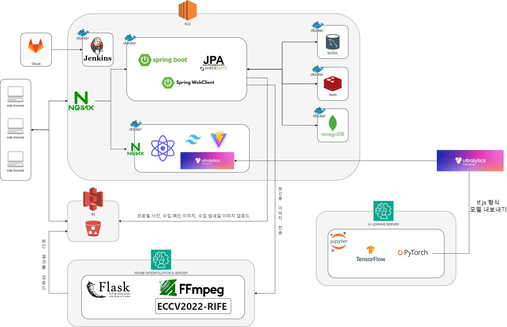

<div align="center">
  <br/>
  
  <br />
  <br />
  <br />
  <h1>GrabPic 📸</h1>
  <h3>작지만 가장 똑똑한, 나만의 생태 도감</h3> 
  <p>2024. 02. 19  ~  2024. 04. 05</p>
  <br/><br/>
</div>

## 🔗 목차

- [서비스 개요](#-서비스-개요)
- [팀원 소개](#-팀원-소개)
- [기술 스택](#-기술-스택)
- [주요 기능](#-주요-기능)
- [명세서](#-명세서)
- [시스템 아키텍처](#-시스템-아키텍처)
- [ERD](#erd)
- [서비스 실사용 화면](#-서비스-실사용-화면)

<br/>

<div id='1'></div>

## 📃 서비스 개요

```markdown
작지만 가장 똑똑한 나만의 생태 도감, GrabPic!

사용자가 카메라에 인식한 개체를 AI 실시간 개체 분류 기술을 통해 분석합니다.
동식물을 도감에 등록하고, 차트를 통해 수집 개체를 한 눈에 확인해보세요!
지도를 통해 주변에서 수집된 동식물 분포도 확인은 물론이고,
개체 상세정보를 조회하면 촬영한 사진을 기반으로 생성된 AI 영상도 제공된답니다.
```
<br/>

<div id='2'></div>

## 👨‍👩‍👧‍👦 팀원 소개

<div align="middle">
  <table>
    <tr>
      <th colspan='3'>Front-End</th>
      <th colspan='2'>Back-End</th>
      <th colspan='1'>AI</th>
    </tr>
    <tr>
      <td height="140px" align="center"> 
        
      </td>
      <td height="140px" align="center"> 
          
      </td>
      <td height="140px" align="center"> 
          
      </td>
      <td height="140px" align="center"> 
          
      </td>
      <td height="140px" align="center"> 
          
      </td>
      <td height="140px" align="center"> 
          
      </td>
    </tr>
    <tr>
      <td align='center'>
        <a href="https://github.com/ByeongJo-Park">👑 박병조 (Leader)</a>
      </td>
      <td align='center'>
        <a href="https://github.com/Gyu-S">📸 양성규</a>
      </td>
      <td align='center'>
        <a href="https://github.com/sunoftwilight">📊 이해진</a>
      </td>
      <td align='center'>
        <a href="https://github.com/eat-alone">🎥 박지훈</a>
      </td>
      <td align='center'>
        <a href="https://github.com/sondongcheon">💾 손동천</a>
      </td>
      <td align='center'>
        <a href="https://github.com/Non-duality">🤖 이준희</a>
      </td>
    </tr>
  </table>
</div>

<br/>

<div id='3'></div>

## 🛠 기술 스택
<div align=middle>
  <h3>🎨  FrontEnd</h3> 
  <div>
    
    
    
    
    
    <br/>
    
    
    
    
    
    
    <br/>
  </div>


<h3>💾  BackEnd</h3>
<div>
  
  
  
  
  <br/>
  
  
  
  
  
</div>

<h3>🤖  AI</h3>
<div>
  
  
  
  
  <br/>
  
  
  
</div>

<h3>💻  Infra</h3>
<div>
  
  
  
  
</div>

<h3>💬  Cooperation</h3>
  <div>
    
    
    
  </div>
</div>
<br/>

<div id='4'></div>

## 💎 주요 기능
<table>
  <tr>
    <th align=center width="120px" height="30px">분류</th>
    <th align=center width="120px" height="30px">기능</th>
    <th align=center width="700" height="30px">내용</th>
  </tr>
  <tr>
    <td width="120px" height="60px"><b>동/식물 인식 및 정보 제공</b></td>
    <td width="120px" height="60px">실시간 인식 및 표시</td>
    <td width="700" height="60px">사용자가 카메라로 촬영 중인 동물이나 식물을 실시간으로 인식하며, 화면에는 인식된 대상의 윤곽선과 이름을 동시에 표시합니다.</td>
  </tr>
  <tr>
    <td width="120px" height="60px"></td>
    <td width="120px" height="60px">정보 제공</td>
    <td width="700" height="60px">인식된 동물 또는 식물에 대해 상세한 정보를 사용자에게 제공합니다.</td>
  </tr>
  <tr>
    <td width="120px" height="60px"><b>도감</b></td>
    <td width="120px" height="60px">도감 등록</td>
    <td width="700" height="60px">사용자가 촬영한 동물 또는 식물의 사진을 개인 도감에 저장하고, 해당 생물에 대한 메모, 수집날짜, 수집 위치를 함께 등록합니다.</td>
  </tr>
  <tr>
    <td width="120px" height="60px"></td>
    <td width="120px" height="60px">차트</td>
    <td width="700" height="60px">사용자가 촬영한 생물들을 종류별로 분류하여, Cytoscape 라이브러리 기반의 차트 형태로 표현함으로써 생물의 다양성을 시각적으로 보여줍니다.</td>
  </tr>
  <tr>
    <td width="120px" height="60px"></td>
    <td width="120px" height="60px">	그리드뷰</td>
    <td width="700" height="60px">촬영한 사진들을 반응형 그리드 형태로 표시, 사용자가 수집한 생물 사진을 시각적으로 쉽게 탐색하고 감상할 수 있도록 합니다.</td>
  </tr>
  <tr>
    <td width="120px" height="60px"></td>
    <td width="120px" height="60px">보간 동영상 제공</td>
    <td width="700" height="60px">사용자가 촬영한 사진들을 이용하여 보간 처리를 거친 동영상을 생성, 촬영한 순간들을 연속적으로 보여주어 생생한 경험을 제공합니다.</td>
  </tr>
  <tr>
    <td width="120px" height="60px"><b>커뮤니티</b></td>
    <td width="120px" height="60px">구독</td>
    <td width="700" height="60px">사용자는 다른 사용자를 구독할 수 있으며, 이를 통해 구독 대상의 도감을 확인할 수 있습니다.</td>
  </tr>
  <tr>
    <td width="120px" height="60px"></td>
    <td width="120px" height="60px">방명록 작성</td>
    <td width="700" height="60px">구독한 사용자의 프로필에 방명록을 작성할 수 있습니다.</td>
  </tr>
  <tr>
    <td width="120px" height="60px"></td>
    <td width="120px" height="60px">갤러리</td>
    <td width="700" height="60px">다른 사용자들이 업로드한 동식물 사진을 피드 형태로 확인할 수 있습니다.</td>
  </tr>
</table>


<br/>

<div id='5'></div>

## 📚 명세서


- <a href='https://indecisive-radius-a20.notion.site/61d4473d638e458dbd8ec8d17dd28217?pvs=4'>요구사항 명세</a>

- <a href='https://indecisive-radius-a20.notion.site/ed365d2d764d431cbbbedf922e6cddfa?pvs=4'>기능 명세</a>

- <a href='https://indecisive-radius-a20.notion.site/API-245ce0adc0ab4b84bcd1f7cea3a0c372?pvs=4'>API 명세</a>

- <a href='https://www.figma.com/file/l4nPbmoEjD0D2KDnB6Y5o3/S10P22D104?type=design&node-id=315%3A2&mode=design&t=VJPuUdMgenJ2bDZL-1'>Figma</a>

- <a href='https://indecisive-radius-a20.notion.site/32c5b997a9b84f4d8c64a06274f3cc54?pvs=4'>시퀀스 다이어그램</a>

<br/>

<div id='6'></div>

## 💡 시스템 아키텍처


<br/>

<div id='7'></div>

## 📐 ERD


<br/>

<div id='8'></div>

## 💝 서비스 실사용 화면

<br/>
